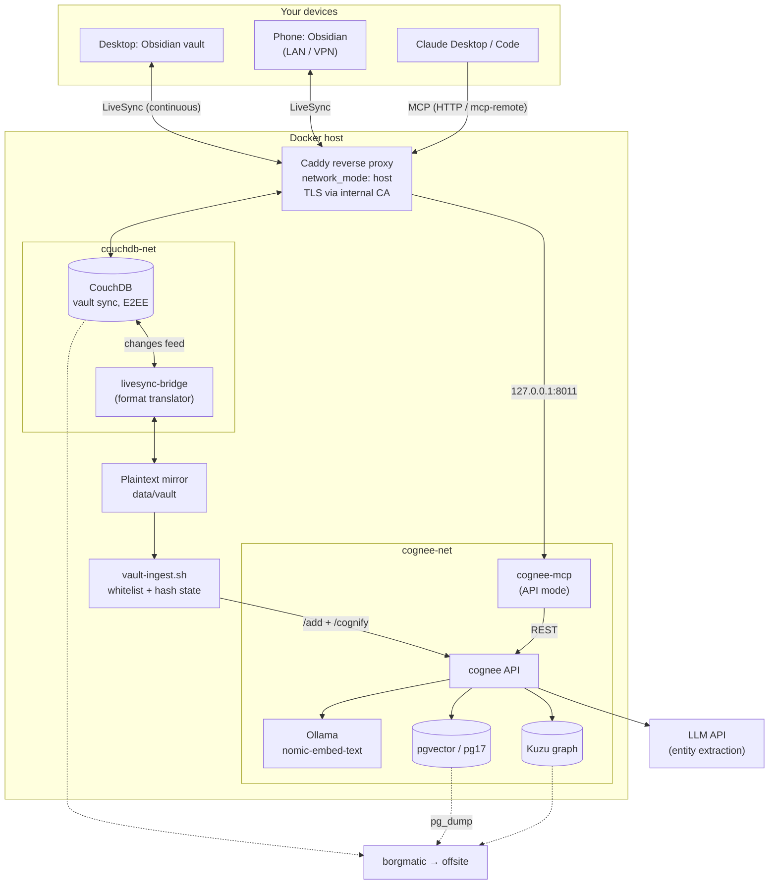

# local-ai-memory

A self-hosted **memory and knowledge graph for Claude**, built on
[Cognee](https://github.com/topoteretes/cognee). Claude (Desktop, Code, or mobile via
MCP) can store facts and recall them across conversations (`remember` / `recall`), and
query a semantic knowledge graph built from your own content.

Everything runs on hardware you control. The only external dependency is an LLM API
(used purely for entity/relation extraction and answer phrasing); embeddings run locally.

> **Obsidian is one way to feed this — not a requirement.**
> The core is the Cognee stack (`cognee` + `pgvector` + `Ollama` + `cognee-mcp`). You can:
> - use it as **pure conversation memory** for Claude, with no notes at all;
> - **ingest any content** — files, exports, scripts' output — through Cognee's HTTP API
>   (`/add` + `/cognify`) from any source;
> - or wire up the **optional Obsidian pipeline** described here to keep a whole vault
>   continuously in sync.
>
> This repo documents the Obsidian pipeline as a concrete, complete example — but treat
> the sync half (CouchDB + livesync-bridge + mirror + `vault-ingest.sh`) as swappable.

In the diagram, the **`cognee-net` box is the core** — it works on its own. Everything on
the left (Obsidian, CouchDB, livesync-bridge, the mirror, `vault-ingest.sh`) is the
**optional Obsidian ingestion path** and can be replaced by any other way of calling
Cognee's `/add` + `/cognify` API.

## How it works, in one breath

**Core (always):**

1. Claude connects to **cognee-mcp** and calls `remember` (persist a fact) or `recall`
   (semantic search over the graph). This alone gives Claude persistent memory — no notes
   required.
2. Anything sent to Cognee's API is chunked, run through the **LLM API** for entity &
   relation extraction, embedded locally with **Ollama**, and stored as vectors in
   **pgvector** and a graph in **Kuzu**.

**Optional — Obsidian ingestion path:**

3. You edit notes in Obsidian. **Self-hosted LiveSync** pushes them (end-to-end
   encrypted) into **CouchDB** within seconds.
4. **livesync-bridge** watches CouchDB's changes feed, decrypts, and writes plain
   `.md` files into a **mirror** directory on the host.
5. **`vault-ingest.sh`** picks up new/changed whitelisted files (SHA-256 change
   detection) and sends them to Cognee (`/add` + one `/cognify`) — the same API any other
   source would use.

Through this path data flows **one way**: vault → graph. Cognee never writes back to your
vault; Obsidian stays the single source of truth, and the graph is reproducible at any
time (cost: one LLM rebuild).

## Repository layout

| Path | What it is |
|---|---|
| [`docs/01-architecture.md`](docs/01-architecture.md) | Components, diagrams, security model, design decisions |
| [`docs/02-installation.md`](docs/02-installation.md) | Step-by-step build from scratch |
| [`docs/03-runbook.md`](docs/03-runbook.md) | Day-2 operations & troubleshooting |
| [`compose/docker-compose.yml`](compose/docker-compose.yml) | All services in one file |
| [`config/`](config/) | Config templates: cognee env, CouchDB, Caddy, bridge, Claude |
| [`scripts/vault-ingest.sh`](scripts/vault-ingest.sh) | Mirror → Cognee ingestion |
| [`.env.example`](.env.example) | Secrets consumed by Compose |

## Conventions used in this documentation

- **Domain:** examples use `home.arpa` (the RFC 8375 domain reserved for home
  networks). Replace it with your own internal domain everywhere.
- **Base directory:** the stack lives in `/srv/docker` (`${STACK_DIR}`). Adjust to taste.
- **Secrets:** any file ending in `.example` contains placeholders — copy it, drop the
  suffix, and fill in real values. Never commit the filled-in copies.

## Component responsibilities

| Component | Its one job |
|---|---|
| Obsidian + LiveSync plugin | Author notes; continuous sync (mode: LiveSync) |
| CouchDB | Sync source of truth in LiveSync format (chunked, E2EE-encrypted) |
| livesync-bridge | Translate LiveSync format ↔ filesystem; decrypt with the E2EE passphrase; bidirectional |
| Plaintext mirror | Decoupled file view of the vault on the host (read-only by convention) |
| vault-ingest.sh | Whitelist scope, hash-based change detection, `/add` + one `/cognify` per run |
| cognee | Pipelines: chunk → LLM extraction → embed → persist; search |
| cognee-mcp | MCP interface (`remember` / `recall` / `forget`); API mode, never touches the DBs |
| Ollama | Local embeddings (768-dim), rate-limited for CPU-only hosts |
| LLM API | Entity/relation extraction and answer phrasing on recall |
| pgvector / Kuzu | Vector + metadata store / knowledge graph (file-based) |

See [`docs/01-architecture.md`](docs/01-architecture.md) for the full picture and the
reasoning behind each choice.
