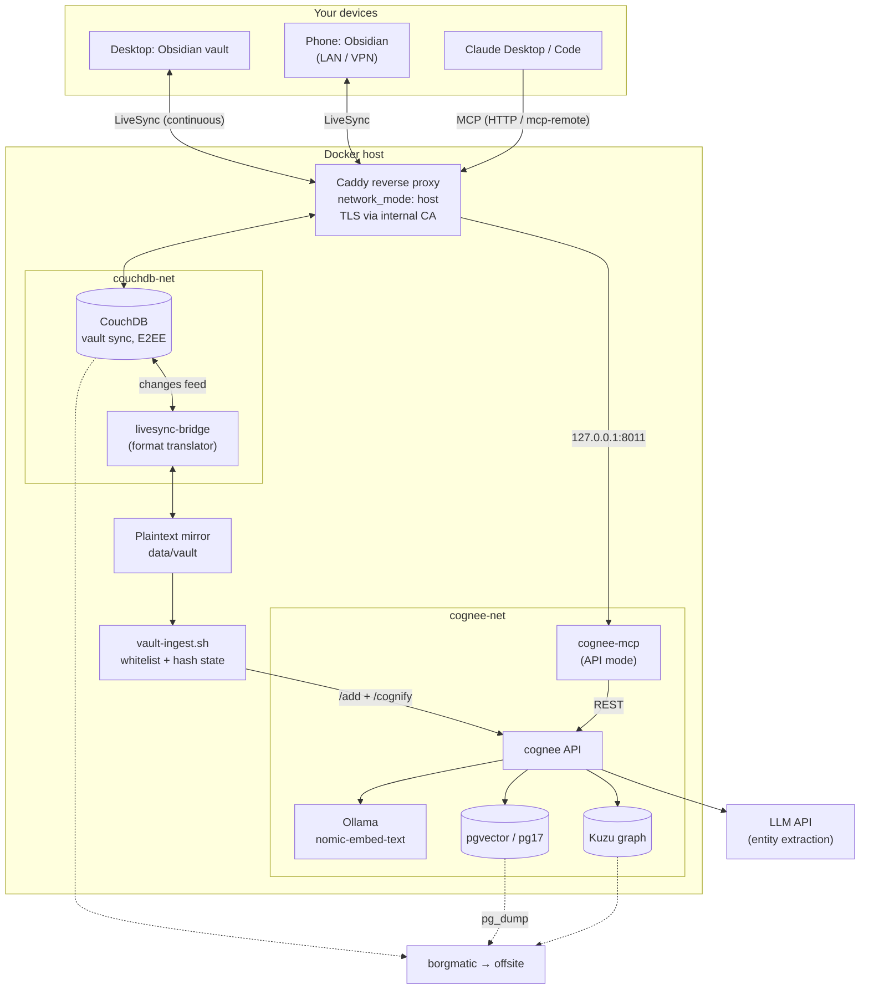
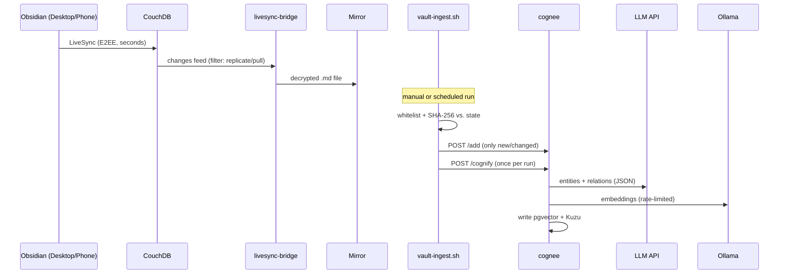
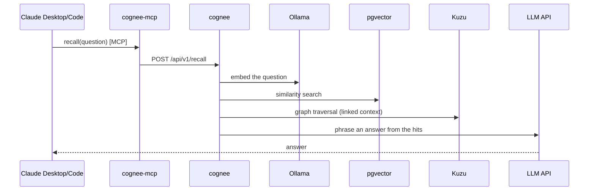

# Architecture

This system turns a personal Obsidian vault into a queryable knowledge graph and a
persistent memory for Claude, running entirely on self-hosted infrastructure. The only
thing that leaves your network is note text sent to an LLM API for extraction (you
control exactly which folders via a whitelist).

## Overview

## Components and their single responsibility

| Component | Responsibility |
|---|---|
| **Obsidian + LiveSync plugin** | Author notes; continuous sync (mode: LiveSync) |
| **CouchDB** | Sync source of truth in LiveSync format (chunked, E2EE-encrypted) |
| **livesync-bridge** | Translate LiveSync format ↔ filesystem; decrypt with the E2EE passphrase; bidirectional |
| **Plaintext mirror** | Decoupled file view of the vault on the host; read-only by convention |
| **vault-ingest.sh** | Whitelist scope, hash-based change detection, `/add` + one `/cognify` per run |
| **cognee** | Pipelines: chunking → LLM extraction → embedding → persistence; search |
| **cognee-mcp** | MCP interface (`remember` / `recall` / `forget`); API mode, never touches the DBs |
| **Ollama** | Embeddings locally (768 dimensions), rate-limited for weak CPUs |
| **LLM API** | Entity/relation extraction, answer phrasing on recall |
| **pgvector / Kuzu** | Vector + metadata store / knowledge graph (file-based) |

## Flow: note → graph

## Flow: question → answer (recall)

## Security model

- **Cognee runs in single-user mode** (`ENABLE_BACKEND_ACCESS_CONTROL=false`,
  `REQUIRE_AUTHENTICATION=false`). No tokens. The security boundary is the network:
  isolated Docker networks, databases with no host port, services bound to
  `127.0.0.1` only, and LAN access exclusively through Caddy.
- **Vault transport:** HTTPS via Caddy's internal CA. The root certificate must be
  installed and trusted on every client (iOS *requires* HTTPS — plain HTTP is blocked).
- **Vault at rest:** end-to-end encrypted inside CouchDB (passphrase in your password
  manager). Deliberate trade-off: the mirror sits in plaintext on the host, and
  whitelisted content passes through the LLM API for extraction. Keep sensitive folders
  out via the whitelist — **new folders are excluded by default**.
- **MCP:** an `MCP_ALLOWED_HOSTS` allowlist keeps DNS-rebinding protection active.

## Key design decisions

1. **Dedicated pgvector instance** instead of reusing a central Postgres: the
   `pgvector` extension requirement plus blast-radius isolation.
2. **cognee-mcp in API mode:** only `cognee` talks to the databases. This eliminates
   version/schema drift between the two independently released images.
3. **Embeddings local, LLM in the cloud:** the encoder runs fine on CPU; usable graph
   extraction needs model classes beyond local hardware. A small/cheap model (e.g. a
   Haiku-class model) is enough for extraction; swap it any time via `.env`.
4. **CouchDB + LiveSync instead of a consumer cloud sync:** you get server-side access
   for ingestion, your own backup chain, and no fragile third-party sync quirks.
5. **Bridge as a format translator:** a direct CouchDB→Cognee path would mean
   re-implementing LiveSync's chunking and E2EE crypto. The bridge is the purpose-built
   adapter. (A self-build is required — the community image is crypto-incompatible with
   current plugin versions.)
6. **Batch ingest with state instead of an event hook:** self-healing (a desired-vs-actual
   comparison catches up on missed runs); real-time updates add no value for a second brain.
7. **Data flows vault → graph only.** Cognee never writes to the vault. Obsidian remains
   the source of truth; the graph is reproducible at any time (cost: one LLM rebuild).

## Networks & ports (defaults)

| Service | Network | Host binding | Notes |
|---|---|---|---|
| cognee | cognee-net | `127.0.0.1:8010 → 8000` | HTTP API; ingest script targets this directly |
| cognee-mcp | cognee-net | `127.0.0.1:8011 → 8000` | MCP endpoint (behind Caddy for clients) |
| cognee-postgres | cognee-net | none (optional `127.0.0.1:5433` for backups) | pgvector |
| ollama-cognee | cognee-net | none | embeddings only |
| couchdb | couchdb-net | `127.0.0.1:5984` | fronted by Caddy for LAN/mobile |
| livesync-bridge | couchdb-net | none | reads changes feed, writes mirror |

All public/LAN entry points terminate at Caddy (`network_mode: host`), which reverse-proxies
to the `127.0.0.1` bindings above under `*.home.arpa` names.
